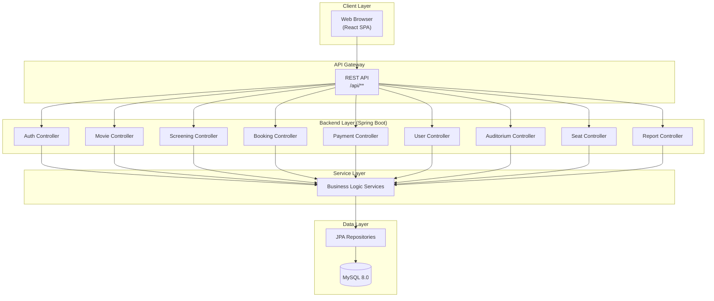
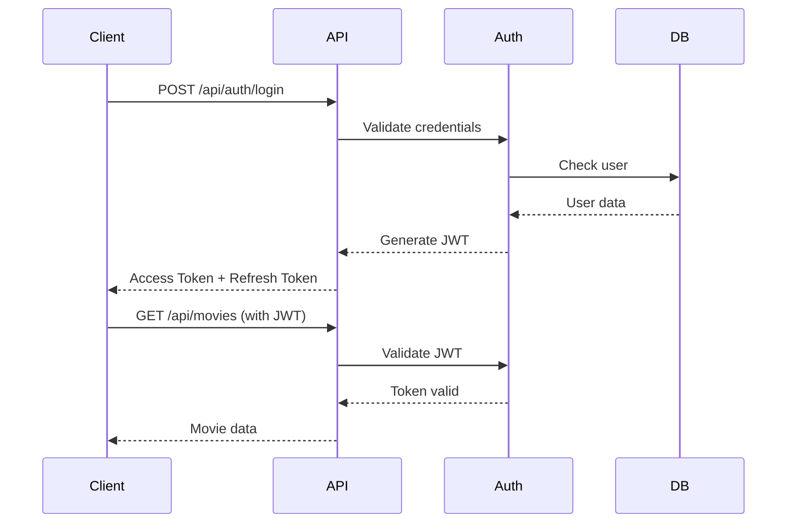
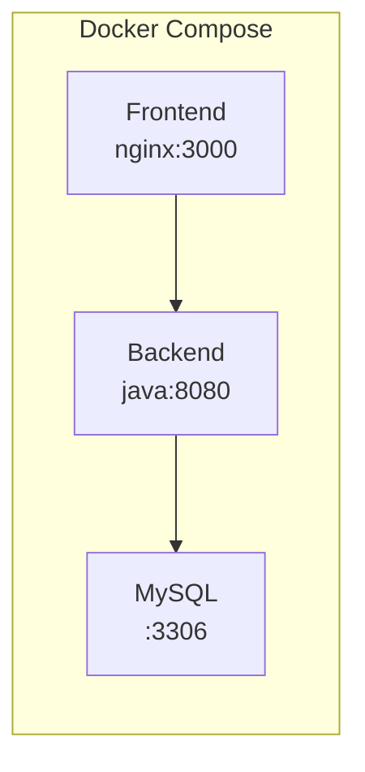
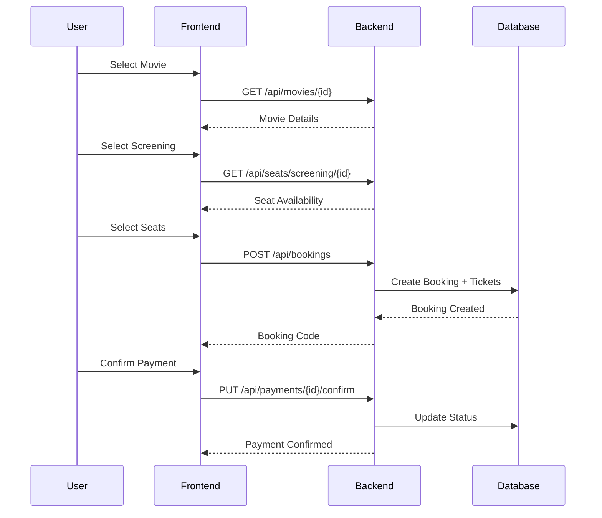

# Architecture Design

**Project**: Movie Ticket Booking System  
**Version**: 1.0  
**Technology Stack**: React + Spring Boot + MySQL

---

## System Overview



---

## Technology Stack

| Layer | Technology | Version |
|-------|------------|---------|
| **Frontend** | React | 18.x |
| **Build Tool** | Vite | latest |
| **Backend** | Spring Boot | 3.5.6 |
| **ORM** | Hibernate/JPA | 6.x |
| **Database** | MySQL | 8.0 |
| **Security** | Spring Security + JWT | |
| **Deployment** | Docker Compose | |

---

## Backend Architecture

### Package Structure

```
com.example.movie/
├── controller/          # REST API Endpoints (9 controllers)
│   ├── AuthController
│   ├── MovieController
│   ├── ScreeningController
│   ├── BookingController
│   ├── PaymentController
│   ├── UserController
│   ├── AuditoriumController
│   ├── SeatController
│   └── ReportController
├── service/             # Business Logic (19 services)
├── repository/          # Data Access (9 repositories)
├── model/               # JPA Entities (10 entities)
├── dto/                 # Data Transfer Objects (39 DTOs)
├── mapper/              # Entity-DTO Mappers (6 mappers)
├── security/            # JWT & Auth (5 classes)
├── exception/           # Custom Exceptions (12 classes)
├── config/              # App Configuration
└── specification/       # Query Specifications
```

### API Endpoints

| Controller | Base Path | Key Endpoints |
|------------|-----------|---------------|
| AuthController | `/api/auth` | POST /login, POST /register, POST /refresh |
| MovieController | `/api/movies` | GET /, GET /{id}, POST /, PUT /{id}, DELETE /{id} |
| ScreeningController | `/api/screenings` | GET /, GET /{id}, POST /, GET /movie/{id} |
| BookingController | `/api/bookings` | POST /, GET /my-bookings, PUT /{id}/cancel |
| PaymentController | `/api/payments` | POST /, PUT /{id}/confirm |
| UserController | `/api/users` | GET /profile, PUT /profile |
| AuditoriumController | `/api/auditoriums` | GET /, POST /, GET /{id}/seats |
| SeatController | `/api/seats` | GET /screening/{id} |
| ReportController | `/api/reports` | GET /bookings, GET /revenue |

---

## Frontend Architecture

### Feature-Based Structure

```
src/
├── features/            # Feature Modules
│   ├── admin/          # Admin Dashboard (17 files)
│   ├── auth/           # Authentication (6 files)
│   ├── booking/        # Booking Flow (12 files)
│   ├── movies/         # Movie Catalog (17 files)
│   └── screenings/     # Screening Selection (3 files)
├── components/          # Shared Components (26 files)
├── services/            # API Client Services (5 files)
├── hooks/               # Custom React Hooks
├── navigation/          # Router Configuration
├── styles/              # Global Styles
└── utils/               # Utility Functions
```

### Key Features

| Feature | Description | Components |
|---------|-------------|------------|
| **auth** | Login, Register, JWT handling | LoginForm, RegisterForm, AuthContext |
| **movies** | Browse, Search, Filter, Details | MovieList, MovieCard, MovieDetail, SearchBar |
| **booking** | Seat selection, Booking flow | SeatMap, BookingForm, BookingSummary |
| **admin** | CRUD operations, Reports | MovieManager, UserManager, BookingManager |

---

## Security Architecture



### Security Components

- **JWT Access Token**: 60 minutes expiry
- **JWT Refresh Token**: 7 days expiry
- **Password Hashing**: BCrypt
- **Role-Based Access**: ADMIN, CUSTOMER

---

## Deployment Architecture



### Docker Services

| Service | Port | Image |
|---------|------|-------|
| frontend | 3000 | node/nginx |
| backend | 8080 | openjdk:17 |
| mysql | 3306 | mysql:8.0 |

---

## Data Flow

### Booking Flow



---

## Non-Functional Requirements

| Requirement | Target | Implementation |
|-------------|--------|----------------|
| Response Time | < 2s | Async queries, indexing |
| Concurrent Users | 50+ | Connection pooling |
| Availability | 99% | Docker restart policies |
| Security | OWASP Top 10 | Input validation, JWT |
