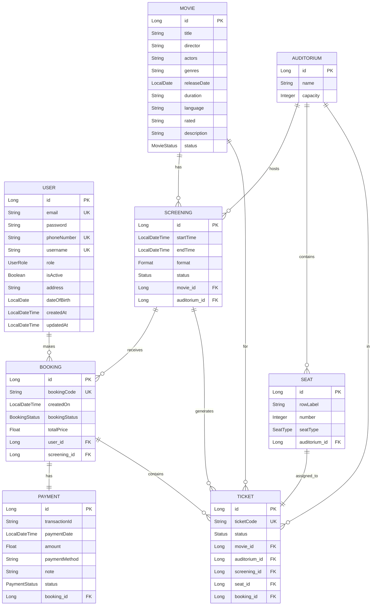

# Database Design

**Project**: Movie Ticket Booking System  
**Database**: MySQL 8.0  
**ORM**: Spring Data JPA / Hibernate

---

## Entity Relationship Diagram

---

## Table Definitions

### 1. users

| Column | Type | Constraints | Description |
|--------|------|-------------|-------------|
| id | BIGINT | PK, AUTO_INCREMENT | User ID |
| email | VARCHAR(255) | NOT NULL, UNIQUE | Email address |
| password | VARCHAR(255) | NOT NULL | BCrypt hashed password |
| phone_number | VARCHAR(20) | NOT NULL, UNIQUE | Phone number |
| username | VARCHAR(50) | NOT NULL, UNIQUE | Username |
| role | ENUM('ADMIN','CUSTOMER') | NOT NULL | User role |
| is_active | BOOLEAN | NOT NULL, DEFAULT TRUE | Account status |
| address | VARCHAR(255) | NOT NULL | Address |
| date_of_birth | DATE | | Birth date |
| created_at | DATETIME | AUTO | Creation timestamp |
| updated_at | DATETIME | AUTO | Last update timestamp |

### 2. movie

| Column | Type | Constraints | Description |
|--------|------|-------------|-------------|
| id | BIGINT | PK, AUTO_INCREMENT | Movie ID |
| title | VARCHAR(255) | NOT NULL | Movie title |
| director | VARCHAR(255) | NOT NULL | Director name |
| actors | TEXT | NOT NULL | Cast list |
| genres | VARCHAR(255) | NOT NULL | Genre tags |
| release_date | DATE | NOT NULL | Release date |
| duration | VARCHAR(20) | NOT NULL | Duration (e.g., "120 min") |
| language | VARCHAR(50) | NOT NULL | Language |
| rated | VARCHAR(10) | NOT NULL | Age rating |
| description | TEXT | NOT NULL | Synopsis |
| status | ENUM('COMING_SOON','NOW_SHOWING','ENDED') | | Movie status |

### 3. auditorium

| Column | Type | Constraints | Description |
|--------|------|-------------|-------------|
| id | BIGINT | PK, AUTO_INCREMENT | Auditorium ID |
| name | VARCHAR(50) | NOT NULL | Room name (e.g., "Room A") |
| capacity | INT | NOT NULL | Total seats |

### 4. seat

| Column | Type | Constraints | Description |
|--------|------|-------------|-------------|
| id | BIGINT | PK, AUTO_INCREMENT | Seat ID |
| row_label | VARCHAR(5) | NOT NULL | Row (A, B, C...) |
| number | INT | NOT NULL | Seat number in row |
| seat_type | ENUM('NORMAL','SWEETBOX') | NOT NULL | Seat type |
| auditorium_id | BIGINT | FK → auditorium(id), NOT NULL | Parent auditorium |

### 5. screening

| Column | Type | Constraints | Description |
|--------|------|-------------|-------------|
| id | BIGINT | PK, AUTO_INCREMENT | Screening ID |
| start_time | DATETIME | NOT NULL | Show start time |
| end_time | DATETIME | | Show end time |
| format | ENUM('TwoD','ThreeD','IMAX') | | Display format |
| status | ENUM('ACTIVE','CANCELLED','FINISHED') | | Screening status |
| movie_id | BIGINT | FK → movie(id), NOT NULL | Movie reference |
| auditorium_id | BIGINT | FK → auditorium(id), NOT NULL | Room reference |

### 6. booking

| Column | Type | Constraints | Description |
|--------|------|-------------|-------------|
| id | BIGINT | PK, AUTO_INCREMENT | Booking ID |
| booking_code | VARCHAR(20) | NOT NULL, UNIQUE | Booking reference code |
| created_on | DATETIME | NOT NULL | Booking timestamp |
| booking_status | TINYINT | NOT NULL | 0=PENDING, 1=PAID, 2=CANCELLED |
| total_price | FLOAT | NOT NULL | Total amount |
| user_id | BIGINT | FK → users(id), NOT NULL | Customer reference |
| screening_id | BIGINT | FK → screening(id), NOT NULL | Screening reference |

### 7. payment

| Column | Type | Constraints | Description |
|--------|------|-------------|-------------|
| id | BIGINT | PK, AUTO_INCREMENT | Payment ID |
| transaction_id | VARCHAR(50) | | External transaction ID |
| payment_date | DATETIME | | Payment timestamp |
| amount | FLOAT | | Payment amount |
| payment_method | VARCHAR(20) | | CASH, BANK_TRANSFER |
| note | TEXT | | Payment notes |
| status | ENUM('PENDING','SUCCESS','FAILED','CANCELLED') | | Payment status |
| booking_id | BIGINT | FK → booking(id), NOT NULL | Booking reference |

### 8. ticket

| Column | Type | Constraints | Description |
|--------|------|-------------|-------------|
| id | BIGINT | PK, AUTO_INCREMENT | Ticket ID |
| ticket_code | VARCHAR(14) | UNIQUE | Unique ticket code |
| status | TINYINT | NOT NULL | 0=AVAILABLE, 1=BOOKED, 2=ISSUED, 3=USED, 4=CANCELLED |
| movie_id | BIGINT | FK → movie(id), NOT NULL | Movie reference |
| auditorium_id | BIGINT | FK → auditorium(id), NOT NULL | Room reference |
| screening_id | BIGINT | FK → screening(id), NOT NULL | Screening reference |
| seat_id | BIGINT | FK → seat(id), NOT NULL | Seat reference |
| booking_id | BIGINT | FK → booking(id), NULLABLE | Booking reference (after booking) |

**Unique Constraint**: `(movie_id, auditorium_id, screening_id, seat_id)` - Prevents double-booking

---

## Indexes

| Table | Index Name | Columns | Purpose |
|-------|------------|---------|---------|
| users | UK_email | email | Fast login lookup |
| users | UK_username | username | Username uniqueness |
| movie | IDX_title | title | Search optimization |
| screening | IDX_movie_time | movie_id, start_time | Showtime queries |
| ticket | UK_screening_seat | screening_id, seat_id | Prevent overselling |
| booking | IDX_user | user_id | User booking history |

---

## Enum Definitions

| Enum | Values | Usage |
|------|--------|-------|
| UserRole | ADMIN, CUSTOMER | User access level |
| MovieStatus | COMING_SOON, NOW_SHOWING, ENDED | Movie availability |
| SeatType | NORMAL, SWEETBOX | Seat pricing tier |
| ScreeningFormat | TwoD, ThreeD, IMAX | Display technology |
| ScreeningStatus | ACTIVE, CANCELLED, FINISHED | Show status |
| BookingStatus | PENDING, PAID, CANCELLED | Booking lifecycle |
| PaymentStatus | PENDING, SUCCESS, FAILED, CANCELLED | Payment state |
| TicketStatus | AVAILABLE, BOOKED, ISSUED, USED, CANCELLED | Ticket lifecycle |

---

## Relationships Summary

| Parent | Child | Relationship | Description |
|--------|-------|--------------|-------------|
| User | Booking | 1:N | One user can have many bookings |
| Movie | Screening | 1:N | One movie can have many screenings |
| Auditorium | Screening | 1:N | One room hosts many screenings |
| Auditorium | Seat | 1:N | One room has many seats |
| Screening | Booking | 1:N | One screening receives many bookings |
| Booking | Payment | 1:1 | One booking has one payment |
| Booking | Ticket | 1:N | One booking contains multiple tickets |
| Ticket | Seat | N:1 | One ticket is for one seat |

---

## Concurrency & Data Integrity

### Preventing Double-Booking

- **Unique Constraint**: `ticket(movie_id, auditorium_id, screening_id, seat_id)`
- **Pessimistic Locking**: Use `SELECT FOR UPDATE` when reserving seats
- **Transaction Isolation**: `SERIALIZABLE` for critical booking operations

### Known Issues (from Bug Report)

- BUG-001/BUG-002: DB lock not preventing race conditions - Requires `SELECT FOR UPDATE` implementation
