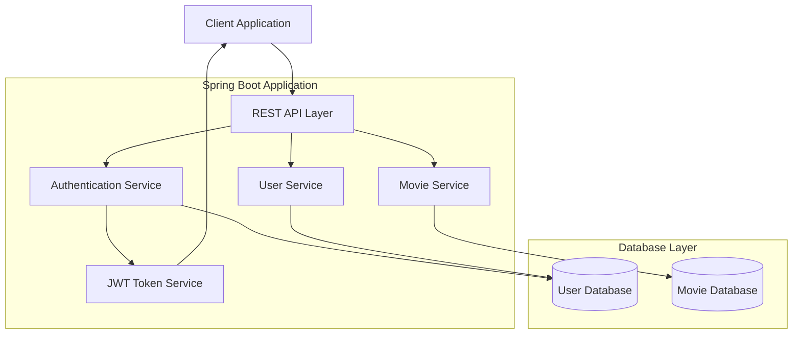
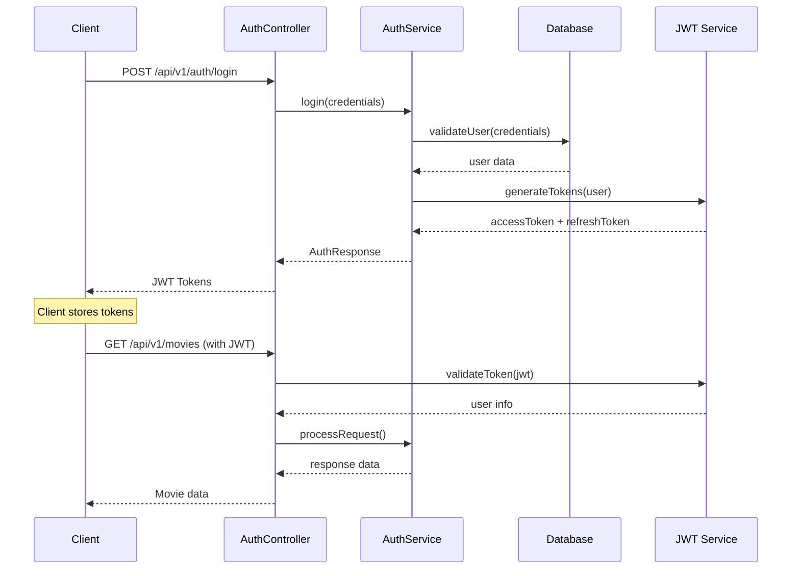
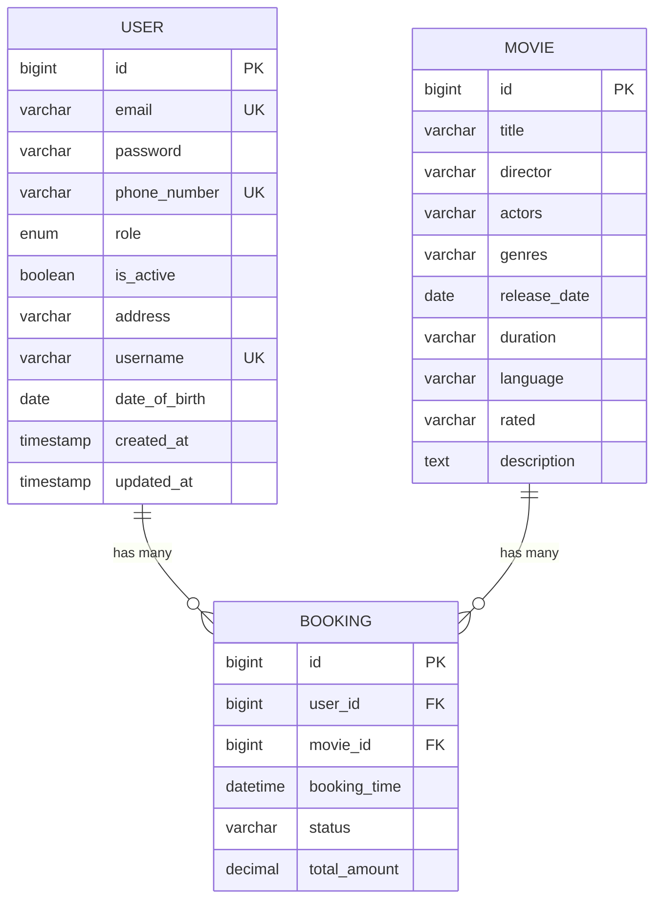
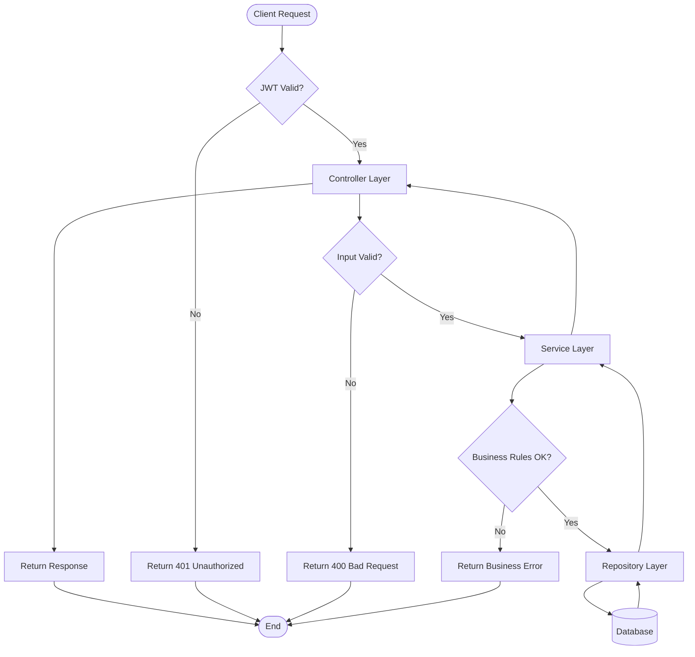
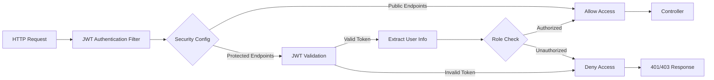

# Tài Liệu Phân Tích Thiết Kế Hệ Thống Kiến Trúc
## Movie Booking System

---

## 1. Tổng Quan Hệ Thống

### 1.1 Mô Tả Dự Án
**Movie Booking System** là một hệ thống đặt vé xem phim được phát triển bằng Spring Boot với kiến trúc RESTful API. Hệ thống cho phép người dùng đăng ký, đăng nhập, quản lý thông tin phim và thực hiện các giao dịch đặt vé.

### 1.2 Công Nghệ Sử Dụng
- **Backend Framework**: Spring Boot 3.5.6
- **Java Version**: Java 17
- **Database**: MySQL 8.0
- **ORM**: Spring Data JPA với Hibernate
- **Security**: Spring Security với JWT
- **Build Tool**: Maven
- **Validation**: Spring Boot Validation
- **Utilities**: Lombok

---

## 2. Kiến Trúc Tổng Thể

### 2.1 Kiến Trúc Layered Architecture
Hệ thống được thiết kế theo mô hình kiến trúc phân lớp (Layered Architecture) với các tầng sau:

```
┌─────────────────────────────────────┐
│           Presentation Layer        │
│         (Controllers)               │
├─────────────────────────────────────┤
│           Business Layer             │
│          (Services)                  │
├─────────────────────────────────────┤
│           Data Access Layer          │
│         (Repositories)               │
├─────────────────────────────────────┤
│           Database Layer             │
│            (MySQL)                   │
└─────────────────────────────────────┘
```

### 2.2 Cấu Trúc Package
```
com.example.movie/
├── controller/          # REST Controllers
├── service/            # Business Logic
│   └── impl/          # Service Implementations
├── repository/         # Data Access Layer
├── model/             # Entity Models
├── dto/               # Data Transfer Objects
│   ├── auth/          # Authentication DTOs
│   ├── movie/         # Movie DTOs
│   ├── user/          # User DTOs
│   └── response/       # Response DTOs
├── security/          # Security Configuration
├── exception/         # Custom Exceptions
└── Mapper/           # Entity-DTO Mappers
```

---

## 3. Các Thành Phần Chính

### 3.1 Entity Models

#### 3.1.1 User Entity
```java
@Entity
public class User {
    private Long id;
    private String email;           // Unique
    private String password;        // Encrypted
    private String phoneNumber;     // Unique
    private UserRole role;          // ADMIN/CUSTOMER
    private Boolean isActive;
    private String address;
    private String username;        // Unique
    private LocalDate dateOfBirth;
    private LocalDateTime createdAt;
    private LocalDateTime updatedAt;
}
```

**Đặc điểm:**
- Hỗ trợ 2 loại vai trò: ADMIN và CUSTOMER
- Sử dụng JPA annotations cho mapping database
- Tự động timestamp với @CreationTimestamp và @UpdateTimestamp
- Validation unique cho email, phoneNumber, username

#### 3.1.2 Movie Entity
```java
@Entity
public class Movie {
    private Long id;
    private String title;
    private String director;
    private String actors;
    private String genres;
    private LocalDate releaseDate;
    private String duration;
    private String language;
    private String rated;
    private String description;
}
```

**Đặc điểm:**
- Lưu trữ thông tin chi tiết về phim
- Sử dụng LocalDate cho ngày phát hành
- Tất cả fields đều required (nullable = false)

### 3.2 Controllers (Presentation Layer)

#### 3.2.1 AuthController
**Base Path**: `/api/v1/auth`

| Method | Endpoint | Mô tả |
|--------|----------|-------|
| POST | `/register` | Đăng ký tài khoản mới |
| POST | `/login` | Đăng nhập hệ thống |

#### 3.2.2 MovieController
**Base Path**: `/api/v1/movies`

| Method | Endpoint | Mô tả |
|--------|----------|-------|
| POST | `/` | Thêm phim mới |
| PATCH | `/{id}` | Cập nhật thông tin phim |
| DELETE | `/{id}` | Xóa phim |
| GET | `/{id}` | Lấy thông tin phim theo ID |

#### 3.2.3 UserController
**Base Path**: `/api/v1/users`
- Quản lý thông tin người dùng

### 3.3 Services (Business Layer)

#### 3.3.1 AuthService
- **Chức năng**: Xử lý logic xác thực và phân quyền
- **Implementations**: AuthServiceImpl
- **Features**:
  - Đăng ký người dùng mới
  - Đăng nhập và tạo JWT token
  - Validation thông tin đăng nhập

#### 3.3.2 MovieService
- **Chức năng**: Quản lý thông tin phim
- **Implementations**: MovieServiceImpl
- **Features**:
  - CRUD operations cho Movie entity
  - Validation dữ liệu đầu vào
  - Mapping giữa Entity và DTO

#### 3.3.3 UserService
- **Chức năng**: Quản lý thông tin người dùng
- **Implementations**: UserServiceImpl
- **Features**:
  - CRUD operations cho User entity
  - Quản lý profile người dùng

### 3.4 Security Configuration

#### 3.4.1 JWT Authentication
```java
@Configuration
@EnableWebSecurity
public class SecurityConfig {
    // JWT Filter Chain
    // Password Encoder (BCrypt)
    // Security Rules
}
```

**Cấu hình Security:**
- **Password Encoding**: BCrypt
- **JWT Configuration**: 
  - Access Token: 15 phút (90000 seconds)
  - Refresh Token: 30 ngày (2592000 seconds)
  - Base64 Secret Key
- **Public Endpoints**: 
  - `/api/v1/auth/**`
  - `/api/v1/movies/**`
  - `/api/v1/users/**`

#### 3.4.2 JWT Filter
- **JwtAuthenticationFilter**: Xử lý JWT token trong request headers
- **JwtConfig**: Cấu hình JWT properties
- **SecurityUtil**: Utility methods cho JWT operations

---

## 4. Database Design

### 4.1 Database Configuration
```properties
spring.datasource.url=jdbc:mysql://localhost:3306/moviebooking
spring.datasource.username=root
spring.datasource.password=1234
spring.jpa.hibernate.ddl-auto=update
spring.jpa.show-sql=true
```

### 4.2 Tables Structure

#### 4.2.1 User Table
```sql
CREATE TABLE user (
    id BIGINT PRIMARY KEY AUTO_INCREMENT,
    email VARCHAR(255) UNIQUE NOT NULL,
    password VARCHAR(255) NOT NULL,
    phone_number VARCHAR(255) UNIQUE NOT NULL,
    role ENUM('ADMIN', 'CUSTOMER') NOT NULL,
    is_active BOOLEAN NOT NULL DEFAULT TRUE,
    address VARCHAR(255) NOT NULL,
    username VARCHAR(255) UNIQUE NOT NULL,
    date_of_birth DATE,
    created_at TIMESTAMP DEFAULT CURRENT_TIMESTAMP,
    updated_at TIMESTAMP DEFAULT CURRENT_TIMESTAMP ON UPDATE CURRENT_TIMESTAMP
);
```

#### 4.2.2 Movie Table
```sql
CREATE TABLE movie (
    id BIGINT PRIMARY KEY AUTO_INCREMENT,
    title VARCHAR(255) NOT NULL,
    director VARCHAR(255) NOT NULL,
    actors VARCHAR(255) NOT NULL,
    genres VARCHAR(255) NOT NULL,
    release_date DATE NOT NULL,
    duration VARCHAR(255) NOT NULL,
    language VARCHAR(255) NOT NULL,
    rated VARCHAR(255) NOT NULL,
    description TEXT NOT NULL
);
```

---

## 5. API Design Patterns

### 5.1 Response Format
Tất cả API responses đều tuân theo format chuẩn:

```java
public class ApiResponse<T> {
    private HttpStatus status;
    private T data;
    private String message;
    private Object errors;
}
```

### 5.2 Error Handling
- **GlobalExceptionHandler**: Xử lý exceptions toàn cục
- **Custom Exceptions**:
  - `EmailAlreadyExistException`
  - `UsernameAlreadyExistException`
  - `InvalidCredentialException`
  - `UserNotFoundException`
  - `InvalidId`
  - `InvalidRoleException`

### 5.3 Validation
- Sử dụng Spring Boot Validation
- Bean validation annotations
- Custom validation cho business rules

---

## 6. Security Architecture

### 6.1 Authentication Flow
```
1. Client gửi login request với credentials
2. Server validate credentials
3. Server tạo JWT token (access + refresh)
4. Client lưu token và gửi trong Authorization header
5. Server validate token cho các protected endpoints
```

### 6.2 Authorization
- **Role-based Access Control (RBAC)**
- **ADMIN**: Full access to all resources
- **CUSTOMER**: Limited access based on business rules

---

## 7. Deployment Architecture

### 7.1 Development Environment
- **Database**: MySQL localhost:3306
- **Application**: Spring Boot embedded Tomcat
- **Port**: Default 8080

### 7.2 Configuration Management
- **application.properties**: Database và JWT configuration
- **Environment-specific**: Có thể override bằng environment variables

---

## 8. Scalability Considerations

### 8.1 Current Limitations
- Single database instance
- No caching layer
- No load balancing
- Stateless JWT (no server-side session)

### 8.2 Future Improvements
- **Database**: Master-slave replication
- **Caching**: Redis for session và movie data
- **Load Balancing**: Multiple application instances
- **Microservices**: Split into domain-specific services

---

## 9. Monitoring và Logging

### 9.1 Logging Configuration
```properties
logging.level.org.springframework.security=DEBUG
logging.level.org.springframework.web=DEBUG
```

### 9.2 Health Checks
- Spring Boot Actuator endpoints
- Database connection monitoring
- JWT token validation monitoring

---

## 10. Testing Strategy

### 10.1 Test Structure
```
src/test/java/com/example/movie/
└── MovieApplicationTests.java
```

### 10.2 Testing Layers
- **Unit Tests**: Service layer testing
- **Integration Tests**: Controller và Repository testing
- **Security Tests**: Authentication và Authorization testing

---

## 11. Sơ Đồ Kiến Trúc

### 11.1 Kiến Trúc Tổng Thể


### 11.2 Luồng Xác Thực (Authentication Flow)


### 11.3 Cấu Trúc Database Schema


### 11.4 Luồng Xử Lý Request


### 11.5 Security Architecture


---

## Kết Luận

Hệ thống Movie Booking được thiết kế với kiến trúc phân lớp rõ ràng, sử dụng các công nghệ hiện đại và best practices của Spring Boot. Kiến trúc hiện tại phù hợp cho ứng dụng quy mô nhỏ đến trung bình với khả năng mở rộng trong tương lai.

**Điểm mạnh:**
- Kiến trúc phân lớp rõ ràng
- Security implementation với JWT
- RESTful API design
- Database normalization
- Comprehensive error handling

**Cần cải thiện:**
- Thêm caching layer
- Implement pagination cho APIs
- Add comprehensive testing
- Database connection pooling optimization
- API documentation với Swagger/OpenAPI
