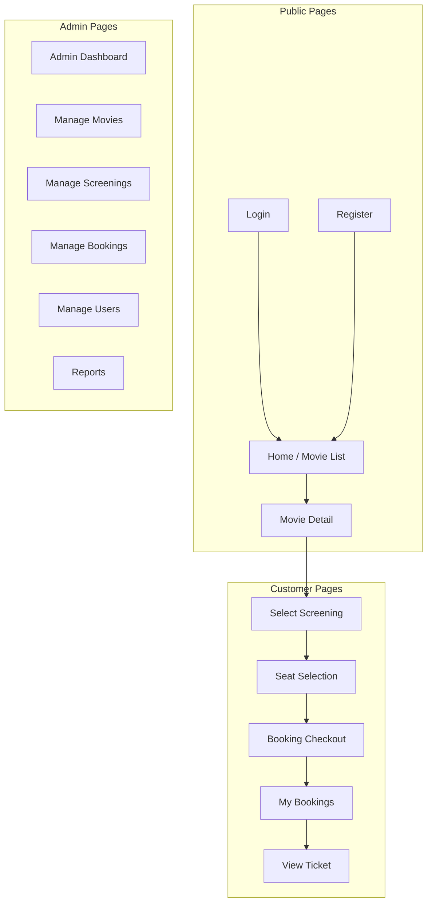

# Screen Design

**Project**: Movie Ticket Booking System  
**Frontend**: React 18 + Vite  
**Styling**: CSS

---

## Screen Overview



---

## Screen List

| # | Screen | Route | Access | Description |
|---|--------|-------|--------|-------------|
| 1 | Home / Movie List | `/` | Public | Browse all movies with search & filter |
| 2 | Movie Detail | `/movies/:id` | Public | View movie info, synopsis, screenings |
| 3 | Login | `/login` | Public | User authentication |
| 4 | Register | `/register` | Public | New user registration |
| 5 | Select Screening | `/screenings/:movieId` | Customer | Choose date/time/format |
| 6 | Seat Selection | `/booking/:screeningId` | Customer | Interactive seat map |
| 7 | Checkout | `/checkout` | Customer | Confirm booking & payment |
| 8 | My Bookings | `/my-bookings` | Customer | View booking history |
| 9 | Ticket View | `/tickets/:bookingId` | Customer | Display ticket with QR code |
| 10 | Admin Dashboard | `/admin` | Admin | Overview & statistics |
| 11 | Manage Movies | `/admin/movies` | Admin | CRUD movie operations |
| 12 | Manage Screenings | `/admin/screenings` | Admin | CRUD screening operations |
| 13 | Manage Bookings | `/admin/bookings` | Admin | View/cancel bookings |
| 14 | Manage Users | `/admin/users` | Admin | User management |
| 15 | Reports | `/admin/reports` | Admin | Revenue & booking reports |

---

## Key Screen Designs

### 1. Home / Movie List

**Purpose**: Allow users to browse and search movies

**Components**:

- Header with navigation & auth status
- Search bar with filter options (genre, status)
- Movie grid (12 per page, pagination)
- Movie cards (poster, title, rating, genres)

**Layout**:

```text
┌────────────────────────────────────────────────────┐
│  LOGO   │ Movies │ My Bookings │ Login │ Register │
├────────────────────────────────────────────────────┤
│  🔍 Search movies...    │ Genre ▼ │ Status ▼      │
├────────────────────────────────────────────────────┤
│ ┌─────┐  ┌─────┐  ┌─────┐  ┌─────┐                │
│ │     │  │     │  │     │  │     │                │
│ │ IMG │  │ IMG │  │ IMG │  │ IMG │                │
│ │     │  │     │  │     │  │     │                │
│ ├─────┤  ├─────┤  ├─────┤  ├─────┤                │
│ │Title│  │Title│  │Title│  │Title│                │
│ │★★★★ │  │★★★  │  │★★★★★│  │★★★★ │                │
│ └─────┘  └─────┘  └─────┘  └─────┘                │
│                                                    │
│              ◀ 1  2  3  4  5 ▶                    │
└────────────────────────────────────────────────────┘
```

---

### 2. Movie Detail

**Purpose**: Show complete movie information and available screenings

**Components**:

- Movie poster (large)
- Movie info (title, duration, rating, genres, director, actors)
- Synopsis/description
- Screening schedule table

**Layout**:

```text
┌────────────────────────────────────────────────────┐
│  ◀ Back                                           │
├────────────────────────────────────────────────────┤
│ ┌───────┐  Title                                   │
│ │       │  ★★★★☆ 4.5 │ 120 min │ Action          │
│ │ POSTER│  Director: John Doe                      │
│ │       │  Cast: Actor A, Actor B                  │
│ │       │  Language: Vietnamese │ Rated: PG-13     │
│ └───────┘                                          │
├────────────────────────────────────────────────────┤
│ Synopsis                                           │
│ Lorem ipsum dolor sit amet, consectetur...         │
├────────────────────────────────────────────────────┤
│ Screenings                                         │
│ ┌──────────┬──────────┬──────────┬──────────┐     │
│ │ Dec 20   │ Dec 21   │ Dec 22   │ Dec 23   │     │
│ ├──────────┼──────────┼──────────┼──────────┤     │
│ │ [10:00]  │ [10:00]  │ [10:00]  │ [10:00]  │     │
│ │ [14:00]  │ [14:00]  │ [14:00]  │ [14:00]  │     │
│ │ [19:00]  │ [19:00]  │ [19:00]  │ [19:00]  │     │
│ └──────────┴──────────┴──────────┴──────────┘     │
└────────────────────────────────────────────────────┘
```

---

### 3. Seat Selection

**Purpose**: Interactive seat map for booking

**Components**:

- Screening info header
- Seat map grid (rows A-J, 10 seats/row)
- Seat legend (Available, Booked, Selected)
- Price summary (updates dynamically)
- Confirm button

**Layout**:

```text
┌────────────────────────────────────────────────────┐
│  Movie Title │ Dec 20, 19:00 │ Room A │ 2D        │
├────────────────────────────────────────────────────┤
│                   [ SCREEN ]                       │
│                                                    │
│     1  2  3  4  5  6  7  8  9  10                 │
│  A  🟢 🟢 🟢 🟢 🟢 🟢 🟢 🟢 🟢 🟢                  │
│  B  🟢 🟢 🔴 🔴 🟢 🟢 🟢 🟢 🟢 🟢                  │
│  C  🟢 🟢 🟢 🟢 🔵 🔵 🟢 🟢 🟢 🟢                  │
│  D  🟢 🟢 🟢 🟢 🟢 🟢 🟢 🟢 🟢 🟢                  │
│  E  🟢 🔴 🔴 🔴 🔴 🔴 🔴 🔴 🔴 🟢                  │
│  ...                                               │
│                                                    │
│  🟢 Available  🔴 Booked  🔵 Selected              │
├────────────────────────────────────────────────────┤
│  Selected: C5, C6                                  │
│  Normal: 2 × 100,000 VND = 200,000 VND            │
│                                                    │
│  Total: 200,000 VND       [ Confirm Booking ]      │
└────────────────────────────────────────────────────┘
```

---

### 4. My Bookings

**Purpose**: View user's booking history

**Components**:

- Filter tabs (All, Upcoming, Past)
- Booking cards (movie, date, seats, status)
- Action buttons (View Ticket, Cancel)

**Layout**:

```text
┌────────────────────────────────────────────────────┐
│  My Bookings                                       │
├────────────────────────────────────────────────────┤
│  [All] [Upcoming] [Past]                           │
├────────────────────────────────────────────────────┤
│ ┌──────────────────────────────────────────────┐  │
│ │ MOVIE TITLE              │ Status: ✅ PAID   │  │
│ │ Dec 20, 2025 │ 19:00     │ Room A           │  │
│ │ Seats: C5, C6            │ Total: 200,000₫  │  │
│ │ Booking Code: ABC123     │                   │  │
│ │ [View Ticket]                                │  │
│ └──────────────────────────────────────────────┘  │
│                                                    │
│ ┌──────────────────────────────────────────────┐  │
│ │ ANOTHER MOVIE            │ Status: ⏳ PENDING │  │
│ │ Dec 25, 2025 │ 14:00     │ Room B           │  │
│ │ [Complete Payment] [Cancel]                  │  │
│ └──────────────────────────────────────────────┘  │
└────────────────────────────────────────────────────┘
```

---

### 5. Admin Dashboard

**Purpose**: Admin overview and quick actions

**Components**:

- Statistics cards (Movies, Bookings, Revenue)
- Quick action buttons
- Recent activity table

**Layout**:

```text
┌────────────────────────────────────────────────────┐
│  Admin Dashboard                  │ Welcome, Admin │
├────────────────────────────────────────────────────┤
│ ┌──────────┐ ┌──────────┐ ┌──────────┐            │
│ │ 📽️ 50    │ │ 🎫 1,234 │ │ 💰 50M   │            │
│ │ Movies   │ │ Bookings │ │ Revenue  │            │
│ └──────────┘ └──────────┘ └──────────┘            │
├────────────────────────────────────────────────────┤
│ Quick Actions                                      │
│ [+ Add Movie] [+ Add Screening] [View Reports]     │
├────────────────────────────────────────────────────┤
│ Recent Bookings                                    │
│ ┌────────────────────────────────────────────────┐│
│ │ ID    │ User    │ Movie    │ Date   │ Status  ││
│ ├────────────────────────────────────────────────┤│
│ │ 1234  │ user@.. │ Avatar   │ Dec 20 │ PAID    ││
│ │ 1233  │ test@.. │ Avengers │ Dec 19 │ PENDING ││
│ └────────────────────────────────────────────────┘│
└────────────────────────────────────────────────────┘
```

---

## Responsive Breakpoints

| Breakpoint | Width | Layout Changes |
|------------|-------|----------------|
| Mobile | < 768px | Single column, stacked cards |
| Tablet | 768px - 1024px | 2-column grid |
| Desktop | > 1024px | Full layout, sidebar |

---

## UI Components

| Component | Usage | Location |
|-----------|-------|----------|
| MovieCard | Display movie in grid | `/components` |
| SeatMap | Interactive seat selection | `/features/booking` |
| BookingCard | Show booking summary | `/features/booking` |
| SearchBar | Movie search with filters | `/components` |
| Modal | Confirmations, alerts | `/components` |
| Pagination | Navigate movie list | `/components` |
| AuthForm | Login/Register forms | `/features/auth` |

---

## Color Scheme

| Element | Color | Hex |
|---------|-------|-----|
| Primary | Blue | #3B82F6 |
| Success | Green | #22C55E |
| Warning | Yellow | #EAB308 |
| Danger | Red | #EF4444 |
| Seat Available | Green | #22C55E |
| Seat Booked | Red | #EF4444 |
| Seat Selected | Blue | #3B82F6 |
